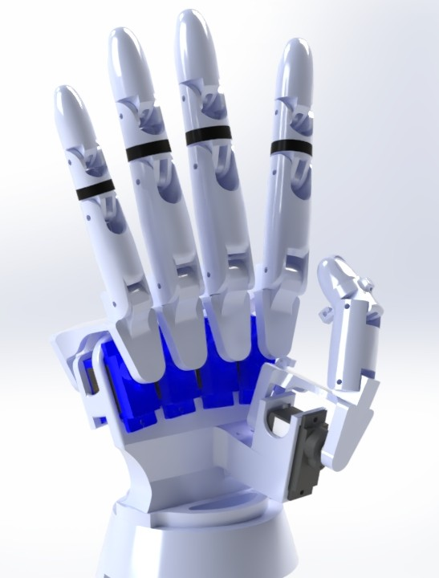
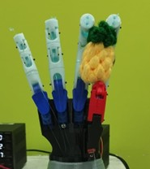
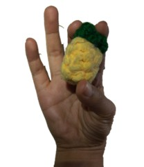
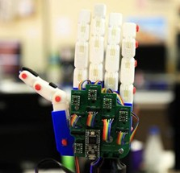
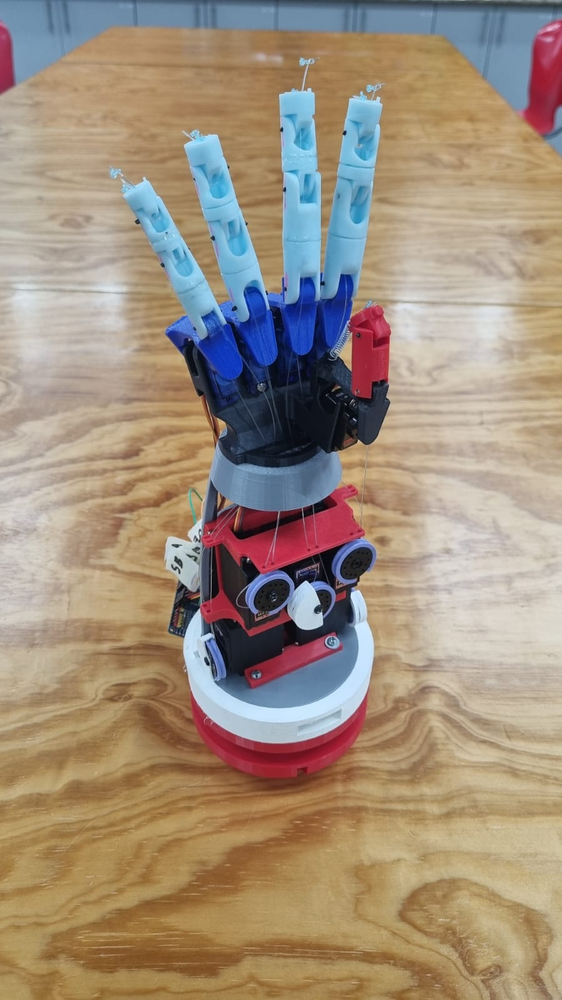
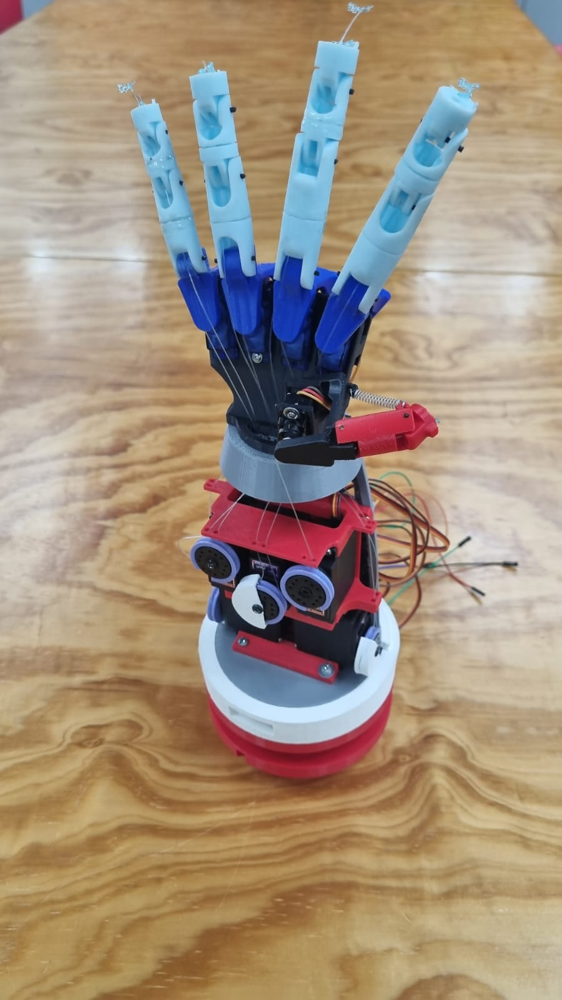
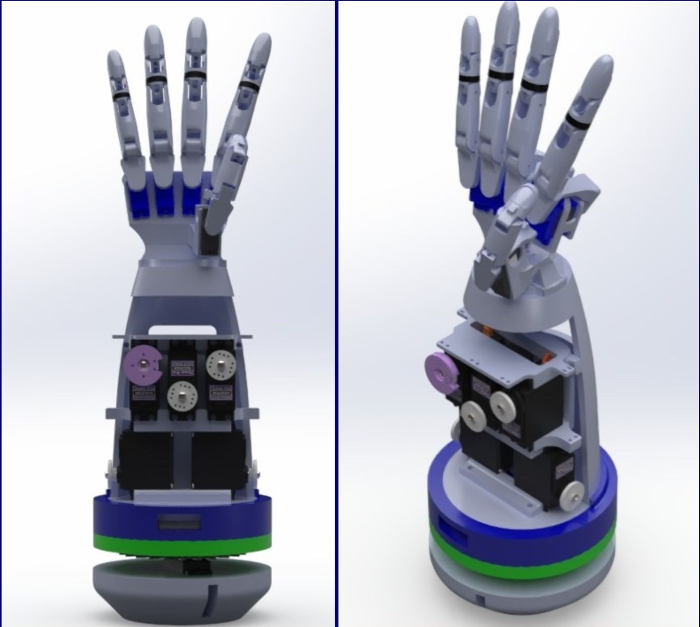

# Ale-HAND-ra: An Open-Source, Low-Cost Humanoid Robotic Hand

**Ale-HAND-ra** is an open-source humanoid robotic hand designed to be affordable, accessible, and highly functional. It leverages digital fabrication techniques like 3D printing to replicate the dexterity and movement of a human hand using low-cost materials. As an open-source initiative, Ale-HAND-ra invites collaboration and customization from the robotics community for educational, prosthetic, or research applications.

  

---

## Table of Contents

- [Ale-HAND-ra: An Open-Source, Low-Cost Humanoid Robotic Hand](#ale-hand-ra-an-open-source-low-cost-humanoid-robotic-hand)
  - [Table of Contents](#table-of-contents)
  - [About the Project](#about-the-project)
  - [Features](#features)
  - [Getting Started](#getting-started)
  - [Estimated Costs](#estimated-costs)
  - [Repository Structure](#repository-structure)
  - [Contributing](#contributing)
  - [License](#license)

---

## About the Project

Ale-HAND-ra addresses the lack of accessible, open-source robotic hands that emulate human functionality. By combining biomechanical analysis with cost-effective 3D printing, this hand achieves 20 degrees of freedom, enabling precise grasping and manipulation of objects of up to 350 grams. Its modular design and use of affordable components—like SG90, EMAX ES08MD II, and MG996R servomotors—make it an ideal platform for hobbyists, students, and researchers.

  
  

---

## Features

- **20 Degrees of Freedom**: Closely mimics human hand biomechanics, supporting flexion, extension, abduction, adduction, and wrist pronation/supination.
- **Modular Design**: Easy to customize, repair, or modify individual components (palm, fingers, forearm).
- **Precise Control**: Powered by an ESP32 microcontroller and PCA9685 PWM module, with wireless control via the Blynk platform.
- **Low-Cost Fabrication**: Built using 3D-printed parts and affordable servomotors, optimized for accessibility.
- **Open-Source**: Fully documented design and code, encouraging community contributions.
  

  

---

## Getting Started

To build your own Ale-HAND-ra, follow these steps:

1. **Review the Build Guide**: See [`documentation/build_guide.md`](./documentation/build_guide.md) for detailed assembly instructions.
2. **Gather Materials**: Check the List of Materials in for required components.
3. **3D Print the Parts**: Use the files from [`design_files/ready_to_print_files/`](./design_files/ready_to_print_files) to 3D print all the hand parts.
4. **Assemble the Hand**: Follow the step-by-step instructions in the build guide.
5. **Upload the Code**: Use the Arduino code at [`code/ALEHANDRA.ino`](./code/ALEHANDRA.ino) to test your hand!

**Prerequisites**:
- 3D printer (FDM or SLA recommended, but not necessary)
- Basic electronics skills (soldering, wiring)
- Arduino programming knowledge

  
  

---

## Estimated Costs

Ale-HAND-ra is designed to be cost-effective. Here’s a breakdown of the cost per hand manufactured:

| Description                     | Quantity     | Subtotal ($) | Comments             |
|---------------------------------|--------------|--------------|----------------------|
| 3D Printing (Resin)             | 264 minutes  | 21.33        | Price per FABLAB UNITEC |
| 3D Printing (PLA)               | 210 minutes  | 10.18        | Price per FABLAB UNITEC |
| EMAX ES08MD II Servomotor       | 1            | 11.72        | N/A                  |
| SG90 Servomotors                | 4            | 26.67        | N/A                  |
| MG996R Servomotors              | 5            | 58.59        | N/A                  |
| ESP32 Microcontroller           | 1            | 16.97        | N/A                  |
| PCA9685 Servo Controller        | 1            | 10.42        | N/A                  |
| Dupont Cables (Female-Female, Male-Male, Male-Female) | 1 | 10.10 | N/A                  |
| Fishing Nylon                   | 1            | 1.90         | N/A                  |
| **TOTAL ($)**                   |              | **167.88**   |                      |

---

## Repository Structure

- **`design_files/`**: 3D models for printing and modification.
  - `ready_to_print_files/`: Ready-to-print files.
  - `solidworks/`: Native SolidWorks files.
- **`code/`**: Code for testing hand movement.
- **`documentation/`**: Extra documentation.
- **`media/`**: Visuals for documentation and README.

---

## Contributing

We welcome contributions to enhance Ale-HAND-ra! To get involved:
- Report bugs or suggest features via GitHub Issues.
- Fork the repo and try it out!
- Share your builds or modifications with the community.
- Leave a star if you like our work!

---

## License

This project is licensed under the [MIT License](LICENSE), allowing free use, modification, and distribution with proper attribution.

---

  

*Multiview Ale-HAND-ra*